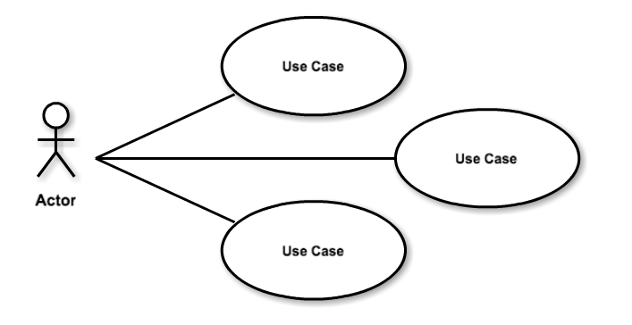

# Funcionalidade Manter Conceito
Breve descrição do objetivo da funcionalidade.  

## Glossário
Conceito1 - Descrição do conceito  
Conceito2 - Descrição do conceito  
	

# Atores
Ator1 - Descrição  
Ator2 - Descrição  

# Diagrama  

  

# [Regras de Negócio](_regras_negocio.md "Regras de negócio da package")  

# Casos de Uso

1. [Incluir](casos-de-uso/incluir.md)  
1. [Listar](casos-de-uso/listar.md)  
1. [Alterar](casos-de-uso/alterar.md)  
1. [Excluir](casos-de-uso/excluir.md)  
1. [Pesquisar](casos-de-uso/pesquisar.md)  
1. [Anular](casos-de-uso/anular.md)  